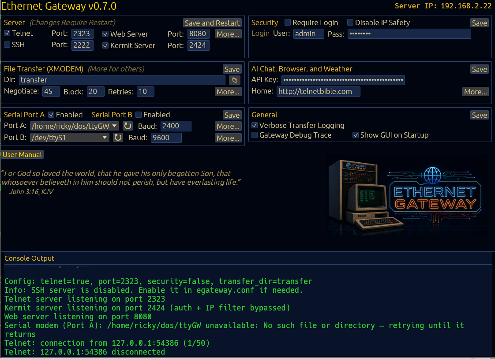

# Ethernet Gateway

A telnet/SSH file-transfer gateway for retro and modern terminals, written in
Rust. It speaks **XMODEM / XMODEM-1K / YMODEM / ZMODEM / Kermit / Punter**,
emulates a **Hayes AT modem** on two independent serial ports, bridges out to
remote **telnet and SSH** hosts, and adds a CP/M-inspired **Gateway Shell**
(an `A>` file manager over the transfer directory), a text-mode **web browser**,
**AI chat**, and a **weather** service. Supports PETSCII (Commodore 64), ANSI,
and ASCII terminals. Designed for local-network use. An optional
**master/slave** mode extends one gateway's serial ports to another over SSH.



**[User Manual](http://ethernetgateway.com/index.html)**
&nbsp;&middot;&nbsp;
**[Kermit Reference](http://ethernetgateway.com/kermit.html)**
&nbsp;&middot;&nbsp;
**[Releases](https://github.com/rickybryce/ethernetgateway/releases)**

Author: Ricky Bryce. Licensed **GPL-3.0-or-later** (see [License](#license)).

> **The full manual lives at [ethernetgateway.com](http://ethernetgateway.com/index.html).**
> This README is a quick start and feature overview; every setting, AT command,
> S-register, RFC, and protocol tunable is documented there in depth.

## Quick Start

```sh
cargo build --release
./target/release/ethernetgateway
```

On first run a default `egateway.conf` is created in the working directory. The
telnet server listens on **port 2323** by default (SSH on **2222** when
enabled). Connect from anywhere on your network (open the firewall port first):

```sh
telnet <server-ip> 2323
ssh <user>@<server-ip> -p 2222   # if the SSH interface is enabled
```

### Connecting retro hardware

The gateway also acts as a **modem emulator** over a serial port, so vintage
machines can dial it with standard AT commands:

- **Altairduino PRO** — connect directly, set the modem port to 2SIO2 (A6/A7 on
  mine; configure the serial ports with *stop + aux1 up*). Run IMP8, press **T**
  for terminal mode, then `ATDT :2323` (or `ATDT ethernetgateway` for the
  gateway menu). I used a USB-to-RS232 adapter into the 9-pin connector.
- **RC2014 / SC126** and similar — also supported. Most machines need a
  **null-modem** adapter (cross RX/TX).

See the [manual](http://ethernetgateway.com/index.html) for wiring, DCD/carrier
options, and the full AT command set.

## Features

- **File transfer** — XMODEM (128-byte), XMODEM-1K, YMODEM, ZMODEM (with
  autostart), Kermit (client **and** server modes), and Punter C1 (Commodore),
  with auto-detection on upload and a protocol prompt on download.
- **Gateway Shell** — a CP/M-inspired `A>` file manager over the transfer
  directory (DIR, TYPE, COPY, MOVE, ERA, REN, MKDIR, …). No Z80 emulation.
- **Modem emulator** — Hayes-compatible AT command set on **two physically
  independent serial ports**, each selectable as *Modem*, *Telnet-Serial
  console bridge*, or *always-on Kermit server*.
- **Outbound gateways** — proxy a telnet session to a remote **telnet** or
  **SSH** host (ANSI stripped for PETSCII/ASCII terminals; TOFU host-key
  verification for SSH).
- **Master/slave relay** — extend a slave gateway's serial ports to a master
  over SSH; files always land on the master.
- **Web browser** — text-mode HTTP/HTTPS/Gopher browsing with numbered links,
  forms, and bookmarks, rendered for 40-column PETSCII up to modern terminals.
- **AI chat** — Q&A powered by the Groq API (free key required).
- **Weather** — current conditions + 3-day forecast for any city/postal code
  worldwide (Open-Meteo, no key required).
- **Three interfaces to configure it** — an in-session telnet/SSH menu, an
  optional web UI, and a desktop GUI (eframe/egui) with live console output.

## Building from Source

Requires the **Rust toolchain** (rustc 1.85+), a **C toolchain**, `cmake`,
`pkg-config`, and (on Linux) `libudev`. Install Rust from
[rustup.rs](https://rustup.rs), then:

```sh
cargo build --release   # binary at target/release/ethernetgateway
```

Per-distro dependency one-liners (Debian/Fedora/Arch/macOS/Windows) are in the
[manual](http://ethernetgateway.com/index.html#ch2-source).

Pre-built, signed binaries for Linux, macOS, and Windows are on the
[Releases](https://github.com/rickybryce/ethernetgateway/releases) page; each
ships a SHA-256 checksum, an optional GPG signature, and a keyless
[Sigstore](https://www.sigstore.dev/) signature so you can verify a download
against its GitHub Actions build.

## Running as a Service

A hardened systemd unit is provided at
[`contrib/systemd/ethernetgateway.service`](contrib/systemd/ethernetgateway.service)
(runs as a dedicated unprivileged user, `ProtectSystem=strict`, syscall
filtering, memory cap). Installation and the port-below-1024 capability note are
in the [manual](http://ethernetgateway.com/index.html#ch2-systemd).

The server handles **SIGINT / SIGTERM / SIGHUP** for graceful shutdown,
notifying connected sessions first.

## Configuration

All settings live in `egateway.conf` (auto-created on first run; plain
`key = value`, `#` comments). You can edit them three ways, all writing the same
file:

- **In-session menu** — press **C** (Configuration) over telnet/SSH.
- **Desktop GUI** — shown on startup when `enable_console = true`; edit
  everything and *Save and Restart*. Set `enable_console = false` for headless.
- **Web UI** — set `web_enabled = true` (default off), then browse to
  `http://<server-ip>:8080`.

Key settings include the telnet/SSH/web/Kermit listeners and ports, a unified
`username` / `password` (shared by all authenticated interfaces), `transfer_dir`,
the two serial ports (`serial_a_*` / `serial_b_*`), and per-protocol tunables.
**The full annotated key reference is in the
[manual](http://ethernetgateway.com/index.html#ch3).**

## Security

**The telnet interface is for local/private networks only.** Telnet transmits
everything — including credentials — in cleartext. Do not expose the telnet port
to the public internet; use the SSH interface for encrypted access, and treat
even that as a trusted-environment tool.

- **Inbound, security disabled (default):** the telnet listener accepts
  connections only from private/loopback/link-local ranges (RFC 1918, `127/8`,
  `169.254/16`, IPv6 `::1` / `fe80::/10` / `fd00::/8`) and refuses `*.*.*.1`
  gateway addresses. To accept any source you must set `security_enabled = true`
  with a strong `username` / `password` (still not recommended on public
  networks — telnet is cleartext).
- **Authentication:** one `username` / `password` pair covers telnet, SSH, and
  the web UI. Three failed logins from an IP trip a shared 5-minute lockout.
  Credentials are stored in plaintext in `egateway.conf` — protect it with file
  permissions; it's lightweight access control, not a security boundary.
- **Outbound (dial-out):** the modem's `ATDT`, the telnet/SSH gateways, and the
  relay's onward-dial connect to whatever host you ask for, with **no**
  internal-address filtering (a modem dials anywhere). The text-mode web browser
  is the exception — it refuses internal addresses (SSRF guard) unless
  `disable_ip_safety` is set.

The master/slave relay lets a trusted slave reach the master's network; only
enable `master_accept_relays` for slaves you trust at that level. Full details,
including the outbound and relay threat model, are in the
[manual](http://ethernetgateway.com/index.html).

## Documentation

Everything below the quick start is covered in depth online:

- **[User Manual](http://ethernetgateway.com/index.html)** — installation,
  configuration reference, every feature, AT command set + S-registers, telnet
  RFC compliance, and the Gateway Shell command set.
- **[Kermit Reference](http://ethernetgateway.com/kermit.html)** — the full
  Kermit surface (client, server, tunables, and G-subcommands).

## Disclaimer

This software is provided on an "as is" basis, without warranties of any kind,
express or implied. Use at your own risk. The author is not responsible for any
data loss, security breaches, or damages resulting from the use of this
software. The user is solely responsible for securing their own network,
credentials, and data. Telnet is an inherently insecure protocol — do not use
this software on untrusted networks.

Portions of this project were developed with the assistance of AI tools
including Claude Code.

## License

This project is licensed under the
[GNU General Public License v3.0 or later](https://www.gnu.org/licenses/gpl-3.0.html)
(GPL-3.0-or-later).

Ethernet Gateway builds on a number of open-source Rust crates; their copyright
notices and license texts are reproduced in
[`THIRD-PARTY-NOTICES.md`](THIRD-PARTY-NOTICES.md), generated by
[`cargo-about`](https://github.com/EmbarkStudios/cargo-about). All dependencies
are permissive- or GPL-compatible-licensed, enforced in CI by
[`cargo-deny`](https://github.com/EmbarkStudios/cargo-deny) against the
allowlist in `deny.toml`.
